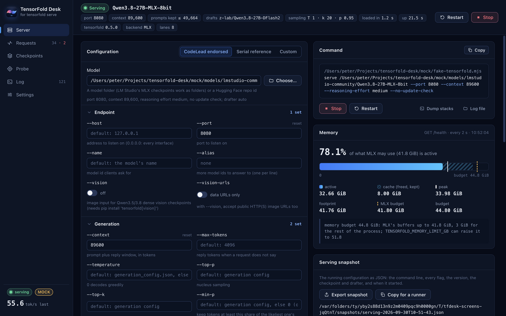

# TensorFold Desk

A macOS app that starts, stops, configures and watches a local `tensorfold serve` process
([TensorFold](https://github.com/ashhart/TensorFold): an OpenAI-compatible LLM server for Apple Silicon).
It reads the server's own log line by line, so every request shows up with its tok/s, prefill, drafts
and prefix-cache figures. The memory gauge follows `GET /health`. Nothing leaves the machine.

The specification is [SPEC.md](SPEC.md). Where TensorFold's real behaviour differs from it, see [NOTES.md](NOTES.md).



## Install

```bash
npm install
npm run build
```

`npm run build` type-checks, bundles, and writes `release/TensorFold-Desk-<version>-arm64.dmg`. Open it and
drag **TensorFold Desk** to Applications.

The app is signed ad hoc, not with a Developer ID. On the Mac that built it, it opens normally. On another
Mac, Gatekeeper may refuse it the first time: right-click the app and choose Open, or clear the quarantine flag.

```bash
xattr -dr com.apple.quarantine "/Applications/TensorFold Desk.app"
```

The app needs a `tensorfold` binary. It was built against 0.3.6.2 and follows 0.5.0, installed on this Mac since
2026-09-30. It finds the binary by itself: first on your login shell's `PATH`, then in any virtualenv folder under
`~/Projects/*/` or `~` that holds one (for example `~/Projects/codelead-bench/tensorfold-venv/bin/tensorfold`). You
can also point to one in Settings. The app reads that binary's own `serve --help`, so the form matches its version.
A flag an older TensorFold lacks is marked, and a newer TensorFold's flags that the app doesn't know yet get plain
fields.

## What it does

| View | |
| --- | --- |
| **Server** | The `tensorfold serve` flags as a form, grouped as the CLI groups them, with presets ("CodeLead endorsed", "Serial reference"). The fields are validated: a model folder must have a `config.json`, the port must be free (the app names a TensorFold server that already holds it), and the context must be a positive integer. The exact command line is shown and can be copied. Start, Stop (SIGTERM, then SIGKILL after the grace period), Restart. The startup lines stream in as they arrive. "Dump stacks" sends SIGUSR1, and TensorFold prints every thread's Python stack into the Log view (for a server that seems stuck). A memory gauge follows `/health` every 2 s. When the server dies, the view shows the exit code and its last 50 lines. While LM Studio is running, an LM Studio card offers "Unload LM Studio, then serve" and "Stop, then restore". When it isn't running, nothing about it is shown. The serving-snapshot card exports JSON and copies the lines for a runner. |
| **Requests** | Every `done` line as a row: prompt, cached, effort, thinking, reply tokens, finish, tok/s, ttft, prefill, prefill tok/s, accepted drafts, ms/round, prefix-cache hits/misses/evictions, sha. Refusals are highlighted rows, with their message and the reply tokens the client asked for. From TensorFold 0.4.0, a request that memory pressure ended is a row too, and a request too long for its prompt to be kept for the next turn is marked (the header shows the limit, "prompts kept ≤ N", and the streams waiting for memory). A live tok/s sparkline, and the session's totals. |
| **Checkpoints** | Scans the LM Studio models folder, the Hugging Face cache, and any folder you add. Each servable checkpoint gets a card built from `tensorfold info`: family, whether it is tested, quantization, max context, size on disk, and whether its drafter is pulled. "Serve this" fills the form. It can pull from Hugging Face, and the tested families' drafters are one click away. |
| **Probe** | Sends one chat completion and measures ttft and tok/s, shown beside the server's own `done` line for the same request. It also runs the saved alternation set: the prompt alone, then after a big generation, then again. |
| **Log** | The raw stream from stdout and stderr, plus the app's own notes. Follow mode, filter, copy. The app's own `/health` polls are hidden unless you show them. |
| **Settings** | The binary, its version and the flags its `serve --help` lists, and a check for a newer release (`tensorfold update --check`; the app shows the command that installs it and installs nothing); checkpoint folders; LM Studio's `lms` and the unload and restore commands; the stop grace period; the `/health` interval; the theme; and a network audit of the window. |

The app watches the servers it starts. A server started elsewhere, such as by a bench runner script, shows up
only as the port being in use; the app names the model it serves.

A menu-bar item shows the state as a dot and the last request's tok/s. Its menu can start and stop the server.
Closing the window keeps the app, and its server, running. Quitting asks before it stops a running server.

Files live in `~/Library/Application Support/TensorFold Desk/`:

- `settings.json`
- `logs/<start-stamp>.log`: the app's copy of each session's log (the newest 50 are kept; see Settings)
- `snapshots/serving-<start-stamp>.json`: exported serving configurations
- `cache/checkpoint-info.json`: cached `tensorfold info` answers

## Settings

| Setting | Default | |
| --- | --- | --- |
| TensorFold binary | found (see Install) | Any `tensorfold`. A `.mjs` file runs under the app's own Node, which is how the mock runs. |
| Checkpoint folders | `~/.lmstudio/models`, `~/.cache/huggingface/hub` | Any folder of checkpoints. The Hugging Face cache layout (`models--org--name/snapshots/<sha>`) is recognized. |
| `lms` | found on `PATH`, then `~/.lmstudio/bin/lms` | Without it, the LM Studio card says so, and nothing is unloaded or started on its behalf. |
| Unload command | `lms unload --all` | Runs before "Unload LM Studio, then serve". A leading `lms` means the `lms` above. The app checks with `lms ps` that nothing is left loaded before it serves. |
| Restore command | empty | Runs after "Stop, then restore", through `/bin/sh`. On Peter's Mac it is set, in his settings rather than in the app, to `cd /Users/peter/Projects/codelead-bench && ./reload-model.sh`: the bench's reload, run from its own folder. The app ships with no CodeLead path. |
| Stop grace period | 30 s | SIGTERM first; SIGKILL only if the server is still alive after this. TensorFold saves its newest conversations while it stops, and a SIGKILL loses them. |
| `/health` interval | 2000 ms | Backs off while the server does not answer. |
| Session logs to keep | 50 | The app writes one log per server session. When a session starts, the oldest beyond this number are deleted, and lowering the number deletes the extra ones at once. 0 keeps them all. Only the app's own session logs are ever deleted. |

## Develop

```bash
npm install
npm run dev:mock
```

| Script | |
| --- | --- |
| `npm run dev` | The app with hot reload, against the real `tensorfold`. |
| `npm run dev:mock` | The same against the mock (below), under its own profile: settings and logs in `TensorFold Desk (mock)`. |
| `npm test` | Unit and integration tests (vitest). The integration tests run the mock as a real child process. |
| `npm run test:e2e` | Builds the app and drives it through its UI against the mock (playwright-core). |
| `npm run test:real` | The acceptance run against the real server (SPEC §6.1, §6.4). It loads the 27B, so it needs the machine's memory for a few minutes. |
| `npm run typecheck` / `npm run lint` | TypeScript strict / ESLint. |
| `npm run screens` | Writes a screenshot of each view against the mock to `docs/screens/`. |
| `npm run build` | The `.dmg` (see Install). `npm run build:app` only bundles. |
| `node scripts/make-icon.mjs` | Draws the app icon from code: `build/icon.svg`, `build/icon.png` (1024 px, rendered by Electron), and the window's copy. |

### The mock

`mock/fake-tensorfold.mjs` stands in for the `tensorfold` CLI (0.5.0, or 0.3.6.2) with no dependencies. The UI can be
built and tested on any Mac without a 27B model.

- `serve` prints the real startup lines from the fixtures and answers `GET /v1/models` and `GET /health`, whose
  memory values rise during each prefill. It answers `POST /v1/chat/completions` too, streamed or not.
  Meanwhile it replays the requests of the 2026-09-29 K3 run, sped up. It refuses what TensorFold refuses: HTTP 400
  for the context window, and `start failed` for memory. SIGTERM kills it at once while it loads; once serving,
  it shuts down and exits 0, as TensorFold does.
- `info`, `models` and `pull` print the real formats (`info` matches the real output byte for byte). `serve --help`
  prints the version's real help, and flags it does not list are refused as argparse refuses them. `update --check`
  answers as `update.py` does, asking no one. SIGUSR1 prints a stack dump on stderr once the memory budget line is out.
- As 0.5.0 it prints the recorded 0.3.6.2 startup lines with the changes 0.5.0's source makes to them (the round's
  streams, the kept-prompt line).
- `mock/fake-lms.mjs` stands in for LM Studio's `lms` (`ps --json`, `unload`, `load`). It keeps its state in `.tmp/`.
- `mock/models/` and `mock/hf-cache/` hold checkpoint folders to scan.

Environment knobs:

| Variable | Default | |
| --- | --- | --- |
| `MOCK_TENSORFOLD_LOAD_MS` | 2500 | How long startup takes |
| `MOCK_TENSORFOLD_TIME_SCALE` | 0.06 | Replayed requests take this fraction of their real duration |
| `MOCK_TENSORFOLD_INTERVAL_MS` | 1500 | Pause between replayed requests; 0 turns the replay off |
| `MOCK_TENSORFOLD_TOKENS_PER_S` | 60 | Decode speed for real chat requests |
| `MOCK_TENSORFOLD_FAIL` | | `startup`, `crash`, `slow-stop` or `ignore-sigterm` |
| `MOCK_TENSORFOLD_VERSION` | 0.5.0 | `0.3.6.2` plays the older version: its help, its lines |
| `MOCK_TENSORFOLD_LATEST` | this version | What `update --check` finds: a version, or `offline` |
| `MOCK_TENSORFOLD_MEMORY` | | `pressure`: the replay's streams wait for memory, and one ends (0.4.0+'s lines) |

The icon joins the two brands. TensorFold's folded sheet, a mesh with lit nodes, twists once, from its coral and
violet into CodeLead's blue and cyan. It sits on CodeLead's dark navy tile, over the glowing cursor of CodeLead's
monogram.

## How it is built

Electron 44 with electron-vite, React 18, TypeScript strict, zustand and electron-store; vitest; electron-builder.

- `src/shared/`: the contract. The serve config (every flag, argv in `--help` order), the log events, `/health`,
  the request feed and its totals, the snapshot.
- `src/main/`: `LogParser` (pure: one line in, one event out), `ProcessManager` (spawn, the state machine
  stopped → loading → serving → stopping, and the exit), `HealthPoller`, `Checkpoints`, `Pull`, `LmStudio`,
  `Probe`, `SnapshotWriter`, `MenuBar`, and `Desk`, which ties them together for IPC.
- `src/preload/`: the typed `window.tfdesk` API. The window runs with `contextIsolation`, `sandbox`, and no
  Node integration.
- `src/renderer/`: the six views. The window makes no network requests: its Content-Security-Policy has
  `connect-src 'none'`, and the main process blocks and records anything but its own files. Only two things reach
  the internet, both started by the user and both made by the `tensorfold` CLI, not the app: a pull
  (huggingface.co) and the update check (api.github.com).

The server is started with `PYTHONUNBUFFERED=1`. TensorFold prints its access lines without flushing, so without
it they would arrive late.

## Acceptance (SPEC §6)

| | | |
| --- | --- | --- |
| 1 | The endorsed preset serves and stops with its exit code (real server) | passes on 0.3.6.2 and 0.5.0 (`npm run test:real`) |
| 2 | Every Appendix A line parses with its exact values | passes (`npm test`), plus all 145 lines of a real 0.3.6.2 serve log and every stdout line of two real 0.5.0 sessions |
| 3 | Requests appear within a second; sparkline, totals, highlighted refusals | passes: real server and mock |
| 4 | The memory gauge moves during a long prefill | passes: during a 36,743-token prefill, 31.3 → 37.4 GiB on 0.3.6.2, 31.1 → 36.4 GiB on 0.5.0 |
| 5 | "Unload LM Studio, then serve"; a clear message without `lms` | passes: the real LM Studio (unload, serve, stop, restore with the bench's reload script) and a fake `lms` |
| 6 | The exported snapshot reproduces the command line | passes: real server and tests |
| 7 | typecheck, test, build; dev:mock; the dmg opens on arm64 | passes |
| 8 | Nothing leaves the machine | the window asks for its own files only; a real pull was not run |

The run, with its figures, is recorded in [NOTES.md](NOTES.md#acceptance-run). [CHANGELOG.md](CHANGELOG.md) lists
what each step added.
